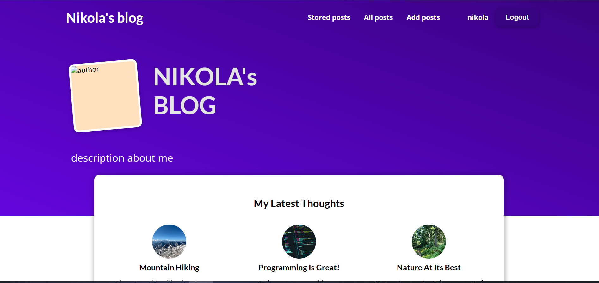

# My Site - Django Blog

This is a Django-based blog application that allows users to create, view, and comment on blog posts. The project features:

- **User Authentication:** Users can log in, and log out (are added via admin not registration since it is a personal blog).
- **Blog Posts:** Authenticated users can create new posts with titles, images, tags, and content.
- **Tags:** Posts can be categorized using tags.
- **Comments:** Visitors can leave comments on individual posts.
- **Read Later:** Users can save posts to read later using session-based storage.
- **Admin Panel:** Manage posts, tags, authors, and comments via Django’s admin interface.

## Structure

- `blog/models.py`: Contains models for Author, Tag, Post, and Comment.
- `blog/views.py`: Handles displaying posts, post details, adding comments, user authentication, and read-later functionality.
- `blog/templates/`: HTML templates for all pages.
- `static/blog/`: Static files including CSS for styling.
- `blog/forms.py`: Forms for post creation, comments, and authentication.

## Getting Started

1. Install dependencies:
   ```
   pip install requirements.txt
   ```
2. Run migrations:
   ```
   python manage.py migrate
   ```
3. Create a superuser:
   ```
   python manage.py createsuperuser
   ```
4. Start the development server:
   ```
   python manage.py runserver
   ```

## Features

- Create, edit, and delete blog posts (admin only, users cannot go to the add post page)
- Register(added via admin since it is a personal blog) and log in as a user
- Comment on posts
- Save posts for later reading (using sessions)

## Pictures of the project

# Main page



# Login page


# Page for adding posts

